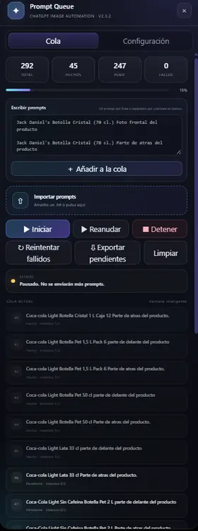
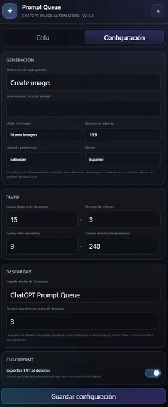

# ChatGPT Prompt Queue

**ChatGPT Prompt Queue** is a free Chrome/Chromium extension built specifically for **ChatGPT Web**. It automates repetitive prompt queues and image-generation workflows directly inside `chatgpt.com`.

Instead of manually copying a prompt, sending it, waiting for ChatGPT to finish, downloading the generated image, renaming it, and repeating the process hundreds of times, you can import a list of prompts and let the extension process them sequentially.

> **Current version: v2.3.2**

## Why use ChatGPT Prompt Queue?

Many prompt-automation services add another paid platform, subscription, credit system, external server, or API workflow on top of ChatGPT.

ChatGPT Prompt Queue takes a simpler approach:

- The extension itself is free and open source.
- No OpenAI API key is required.
- No additional subscription is required by the extension.
- No external prompt-processing service is required.
- It works directly with the ChatGPT session already open in your browser.
- Queue state and settings are stored locally in the browser.

You still need a working ChatGPT account and access to the ChatGPT features you want to use. Any ChatGPT plan limits or usage limits still apply.

## What it does

The basic workflow is:

~~~text
Import prompts
→ Send prompt to ChatGPT
→ Wait for generation
→ Detect the new image
→ Download it automatically
→ Rename it using the original prompt
→ Continue with the next prompt
~~~

Everything happens directly on the ChatGPT website.

## Screenshots

| Prompt queue | Configuration |
| --- | --- |
|  |  |

The queue view shows prompt importing, progress, pause/resume controls, retries, pending exports and per-prompt status. The configuration view lets you adjust prompt prefix/suffix, generation preferences, timing, retries, download folder and checkpoint behavior.

## Main features

### Automatic prompt queue

Add prompts manually or import a large list from a `.txt` file.

The extension processes prompts one by one without requiring you to manually paste and send every item.

### TXT import

A prompt file can be as simple as:

~~~text
Coca-Cola Zero Bottle PET 2L Front View
Coca-Cola Zero Bottle PET 2L Back View
Coca-Cola Light Can 330ml Front View
Coca-Cola Light Can 330ml Back View
~~~

Each line becomes an item in the queue.

### Direct image downloading

Starting with the direct-download workflow introduced in v2.2, the extension no longer relies on manually clicking ChatGPT image-card download or share controls.

It detects the generated image resource and downloads it through Chrome's downloads API without leaving ChatGPT.

### Automatic filenames

Downloaded images use the **original prompt** as the filename.

Example:

~~~text
Coca-Cola Zero Bottle PET 2L Front View.png
~~~

Invalid filename characters are cleaned automatically.

If the same filename already exists, Chrome can create another copy such as:

~~~text
Coca-Cola Zero Bottle PET 2L Front View (1).png
~~~

### Forced download folder

Version 2.3 improved download naming and folder handling using `chrome.downloads.onDeterminingFilename`.

The default destination is:

~~~text
Downloads/ChatGPT Prompt Queue/
~~~

A custom subfolder can also be configured.

### Pause, resume and stop

The queue can be paused and resumed.

Stopping the automation invalidates the active worker so the extension does not continue sending new prompts after the stop action.

### Automatic retries

If a prompt fails, takes too long, or the image cannot be downloaded, the extension can retry the **same prompt** before moving on.

You can configure:

- Maximum attempts
- Retry delay
- Generation timeout
- Download timeout
- Delay after a completed download

Prompts that still fail after the configured number of attempts can be processed again later.

### Retry failed prompts

Failed items can be returned to the queue without restarting the full job.

This is useful when ChatGPT has a temporary generation or connection problem.

### Progress recovery

The extension stores queue state and settings with:

~~~javascript
chrome.storage.local
~~~

If the ChatGPT page is refreshed, the queue can be recovered.

For safety, a recovered session does not automatically begin sending prompts again. You choose when to continue.

### Checkpoints

When stopping a large job, ChatGPT Prompt Queue can export a new TXT file containing only the prompts that have not been completed yet.

Example:

~~~text
Initial prompts: 1000
Completed: 742
Remaining: 258
~~~

The checkpoint file contains only the remaining prompts, making it easy to continue later.

There is also a manual option to export pending prompts.

### Prompt prefix and suffix

You can automatically add text before or after every prompt.

Example:

Original prompt:

~~~text
Coca-Cola Zero Bottle PET 2L Front View
~~~

Configured prefix:

~~~text
Create image:
~~~

Prompt sent to ChatGPT:

~~~text
Create image: Coca-Cola Zero Bottle PET 2L Front View
~~~

The downloaded filename still uses the original prompt rather than the added prefix or suffix.

### Large queues

The interface uses a windowed list so it does not need to render thousands of queue items at the same time.

This keeps very large prompt lists more manageable.

### Multiple interface languages

The extension interface supports:

- English
- Spanish
- Catalan

## How it differs from paid queue tools

ChatGPT Prompt Queue does not create a separate AI-generation platform.

It automates the repetitive browser workflow around ChatGPT itself.

### Without ChatGPT Prompt Queue

~~~text
Copy prompt
→ Paste
→ Send
→ Wait
→ Find generated image
→ Download
→ Rename
→ Repeat
~~~

### With ChatGPT Prompt Queue

~~~text
Import prompts
→ Press Start
→ Let the queue process them
~~~

There are no extension credits to buy and no separate API-billing integration required.

## Installation

ChatGPT Prompt Queue is currently installed as an **unpacked Chrome extension**.

### Google Chrome

1. Download or clone this repository.
2. Extract it if you downloaded a ZIP.
3. Open Chrome.
4. Go to `chrome://extensions`.
5. Enable **Developer mode**.
6. Click **Load unpacked**.
7. Select the folder containing `manifest.json`.
8. Open or refresh `https://chatgpt.com/`.

The ChatGPT Prompt Queue interface should appear inside ChatGPT.

### Microsoft Edge

1. Open `edge://extensions`.
2. Enable **Developer mode**.
3. Choose **Load unpacked**.
4. Select the extension folder.
5. Open or refresh ChatGPT.

Other Chromium-based browsers may also work if they support Manifest V3 extensions and the required Chrome extension APIs.

## Requirements

- Google Chrome, Microsoft Edge, or another compatible Chromium browser
- A working ChatGPT account
- Access to `chatgpt.com`
- The extension loaded in the browser

**No OpenAI API key is required.**

## ChatGPT only

This project is developed specifically for the ChatGPT website.

It is **not** a universal automation extension for Gemini, Claude, Copilot, Midjourney, or other AI platforms.

The extension currently limits its website access to:

~~~text
https://chatgpt.com/*
https://www.chatgpt.com/*
~~~

## Privacy and local storage

The extension does not require an external prompt-queue server.

Queue data and configuration are stored locally in the browser using `chrome.storage.local`.

Prompts are submitted through the ChatGPT page you already have open.

## Browser permissions

Version 2.3.2 uses Chrome extension permissions including:

- `storage`
- `downloads`
- `tabs`
- `scripting`

These are used for queue persistence, automatic downloads, interaction with the ChatGPT tab, and extension functionality.

## Good use cases

ChatGPT Prompt Queue is useful for workflows such as:

- E-commerce product images
- Product catalogs
- Bulk image generation
- AI asset generation
- Dataset creation
- Prompt testing
- Content-production workflows
- Repetitive ChatGPT tasks

## Version history

### v2.3.x

- Improved forced filenames and download-folder handling.
- Registers the desired filename before creating the download.
- Uses `chrome.downloads.onDeterminingFilename` to apply the configured destination.
- Keeps the original prompt as the downloaded filename.

### v2.2

- Introduced direct image downloading.
- Removed dependency on clicking ChatGPT share/download controls.
- Downloads generated image resources through `chrome.downloads.download`.

### v2.1

- Added direct prompt entry.
- Added configurable prompt prefix and suffix.
- Added English, Spanish, and Catalan interface languages.
- Added visual preference controls.
- Improved queue and download timing controls.

### v2.0

- Added real pause/stop behavior.
- Added per-prompt retries.
- Added checkpoint export.
- Added automatic prompt-based filenames.
- Added configurable download subfolder.
- Improved large-queue rendering.

## Important compatibility note

ChatGPT is a web application and its interface can change over time.

ChatGPT Prompt Queue uses heuristic detection for ChatGPT's prompt editor, generated images, and related page elements. Minor interface changes may continue to work normally, but major ChatGPT UI or DOM changes may require an extension update.

## License

This project is released under the **MIT License**. See [LICENSE](LICENSE).

## Disclaimer

ChatGPT Prompt Queue is an independent open-source project and is not affiliated with, endorsed by, or sponsored by OpenAI.

ChatGPT and OpenAI are trademarks of their respective owners.
